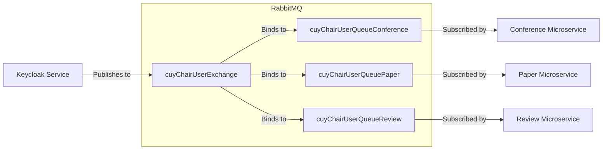
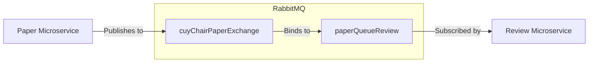

# RabbitMQ
Documentación de RabbitMQ

## Diagramas

```mermaid
flowchart LR
    subgraph RabbitMQ
        direction TB
        cuyChairUserExchange["cuyChairUserExchange"]

        userQueueConference["cuyChairUserQueueConference"]
        userQueuePaper["cuyChairUserQueuePaper"]
        userQueueReview["cuyChairUserQueueReview"]

        cuyChairUserExchange -- Binds to --> userQueueConference
        cuyChairUserExchange -- Binds to --> userQueuePaper
        cuyChairUserExchange -- Binds to --> userQueueReview
    end

    KeycloakService["Keycloak Service"] -- Publishes to --> cuyChairUserExchange
    
    userQueueConference -- Subscribed by --> ConferenceMicroservice["Conference Microservice"]
    userQueuePaper -- Subscribed by --> PaperMicroservice["Paper Microservice"]
    userQueueReview -- Subscribed by --> ReviewMicroservice["Review Microservice"]
```

```mermaid
flowchart LR
    subgraph RabbitMQ
        direction TB
        cuyChairConferenceExchange["cuyChairConferenceExchange"]

        conferenceQueuePaper["cuyChairConferenceQueuePaper"]

        cuyChairConferenceExchange -- Binds to --> conferenceQueuePaper
    end

    ConferenceMicroservice["Conference Microservice"] -- Publishes to --> cuyChairConferenceExchange

    conferenceQueuePaper -- Subscribed by --> PaperMicroservice["Paper Microservice"]
```

```mermaid
flowchart LR
    subgraph RabbitMQ
        direction TB
        cuyChairPaperExchange["cuyChairPaperExchange"]

        paperQueueReview["paperQueueReview"]

        cuyChairPaperExchange -- Binds to --> paperQueueReview
    end

    PaperMicroservice["Paper Microservice"] -- Publishes to --> cuyChairPaperExchange

    paperQueueReview -- Subscribed by --> ReviewMicroservice["Review Microservice"]
```
